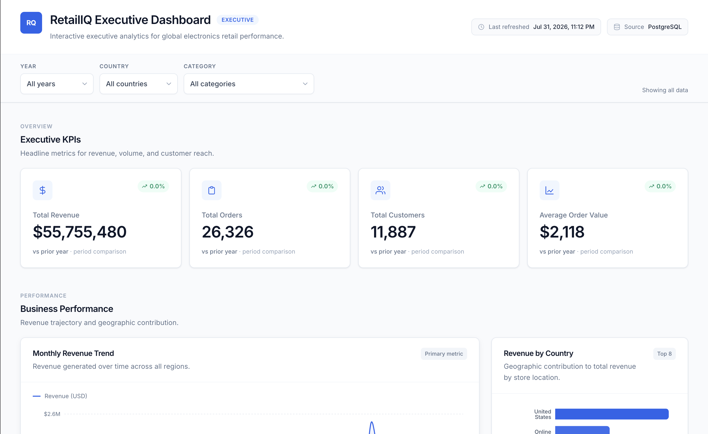
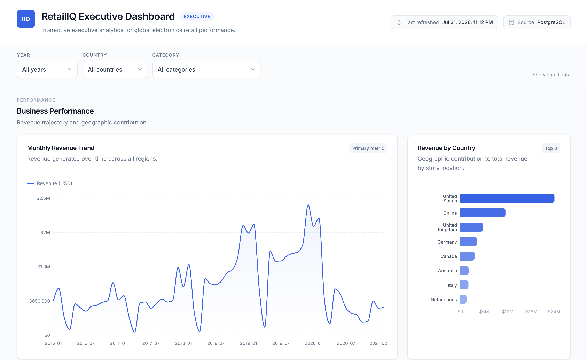
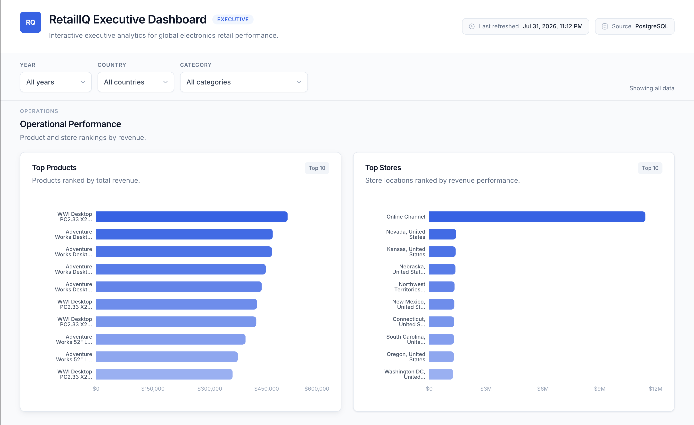
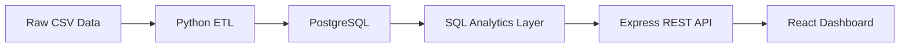
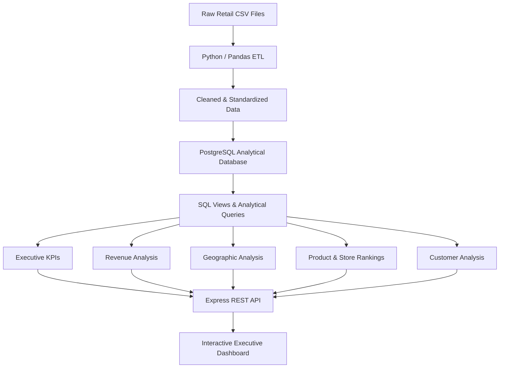

# RetailIQ — Executive Retail Analytics Dashboard

An end-to-end **Business Intelligence and Data Analytics project** analyzing global electronics retail performance across revenue, customers, stores, countries, products, brands, and categories.

RetailIQ transforms raw transactional CSV data through a **Python ETL pipeline** into a **PostgreSQL analytical model**, applies SQL-based business logic, and presents decision-ready insights through an interactive executive dashboard.

🔗 **[View Live Dashboard](https://retailiq-executive-dashboard.vercel.app/)**

---

## Dashboard Preview



---

## Business Problem

Retail organizations generate transactional data across products, customers, stores, geographic markets, and time periods. Without a centralized analytical layer, answering fundamental management questions quickly becomes difficult.

This project was designed to answer questions such as:

- How is revenue changing over time?
- Which countries and stores contribute the most revenue?
- Which products, brands, and categories drive business performance?
- Who are the highest-value customers?
- How does performance vary across different market segments?
- How can raw transactional data be transformed into decision-ready executive metrics?

RetailIQ consolidates these dimensions into a structured analytical model and interactive dashboard for executive-level performance monitoring.

---

## Key Metrics

The dashboard tracks four primary executive KPIs:

| KPI | Overall Result |
|---|---:|
| Total Revenue | **$55.76M** |
| Total Orders | **26,326** |
| Total Customers | **11,887** |
| Average Order Value | **$2,118** |

These metrics can be dynamically analyzed using **Year, Country, and Product Category** filters.

---

## Business Performance Analysis



The performance layer provides:

- Monthly revenue trend analysis
- Geographic revenue contribution
- Country-level performance comparison
- Historical revenue patterns
- Filtered analysis across time, market, and product category

This view allows decision-makers to identify revenue concentration, historical changes, and differences between geographic markets.

---

## Operational Performance



Operational analysis ranks key business entities by revenue, including:

- Top-performing products
- Highest-revenue stores
- Online vs. physical store contribution
- Product performance concentration
- Store-level revenue contribution

These rankings help identify which products and sales locations contribute most heavily to overall business performance.

---

## Analytics Capabilities

RetailIQ provides analysis across several business dimensions:

### Revenue Analysis

- Total revenue monitoring
- Monthly revenue trends
- Period-over-period comparisons
- Revenue segmentation using interactive filters

### Geographic Analysis

- Revenue by country
- Market contribution comparison
- Store performance across locations
- Online channel performance

### Product Analysis

- Top products by revenue
- Brand performance
- Category contribution
- Product ranking and segmentation

### Customer Analysis

- Total customer monitoring
- Highest-value customer identification
- Customer revenue contribution
- Average order value analysis

---

## Data Pipeline

The project follows an end-to-end analytics workflow:



### 1. Raw Data

Transactional retail datasets are stored as CSV files covering business entities such as:

- Sales
- Customers
- Products
- Stores
- Geographic information

### 2. Python ETL

A Python/Pandas pipeline prepares the source data before database loading.

The ETL process handles:

- File ingestion
- Encoding detection
- Data cleaning
- Data type normalization
- Missing-value handling
- Transformation of source fields
- Generation of database-ready datasets

### 3. PostgreSQL Analytical Model

Processed data is loaded into PostgreSQL and organized for analytical querying.

The database layer separates transactional measures from descriptive business dimensions, enabling efficient analysis across:

- Time
- Products
- Customers
- Stores
- Geography

### 4. SQL Analytics Layer

SQL queries and database views calculate business metrics used throughout the dashboard.

Examples include:

- Revenue aggregation
- Order counts
- Customer counts
- Average order value
- Monthly revenue
- Country rankings
- Store rankings
- Product rankings
- Brand and category performance

### 5. Dashboard

The analytics results are exposed through an Express REST API and visualized through a React dashboard with reusable filtering and chart components.

---

## Analytical Architecture



---

## Interactive Filtering

The dashboard supports multidimensional filtering across:

- **Year**
- **Country**
- **Product Category**

Filters can also be combined.

For example:

```text
Year: 2020
Country: United States
Category: Computers
```

The dashboard then recalculates the corresponding KPIs, trends, rankings, and analytical views for that specific business segment.

This allows the same analytical model to support both high-level executive monitoring and more focused segment analysis.

---

## Tech Stack

### Data & Analytics


### Application Layer


### Deployment


---

## Repository Structure

```text
retailiq-executive-dashboard/
│
├── analysis/
│   └── executive_analysis.sql
│       # Business-focused analytical SQL queries
│
├── dashboard/
│   └── bi_specification.md
│       # Dashboard requirements and BI specification
│
├── data/
│   ├── raw/
│   │   # Original source datasets
│   └── processed/
│       # Cleaned ETL outputs
│
├── docs/
│   ├── screenshots/
│   │   ├── executive-overview.png
│   │   ├── performance-analysis.png
│   │   └── operational-analysis.png
│   └── ...
│       # Data documentation and supporting material
│
├── etl/
│   ├── config.py
│   ├── io_utils.py
│   ├── transform.py
│   └── run_etl.py
│       # Python/Pandas ETL pipeline
│
├── frontend/
│   ├── public/
│   │   └── data/
│   │       ├── dashboard.json
│   │       └── filters.json
│   └── src/
│       # Interactive React dashboard
│
├── server/
│   ├── scripts/
│   │   └── export-static-data.ts
│   └── src/
│       # Express API and database query layer
│
├── sql/
│   ├── schema.sql
│   ├── import.sql
│   └── views.sql
│       # PostgreSQL schema and analytics views
│
└── requirements.txt
```

---

## SQL & Business Intelligence

SQL serves as the primary analytical layer between the PostgreSQL database and dashboard.

Rather than performing business calculations directly inside visualization components, metrics are derived from structured database queries and views.

This separates the project into distinct layers:

```text
Raw Data
   ↓
Data Transformation
   ↓
Analytical Database
   ↓
Business Logic / SQL
   ↓
API
   ↓
Visualization
```

This architecture makes analytical definitions reusable and keeps the dashboard focused on presentation rather than data transformation.

---

## Static Portfolio Deployment

The full development architecture uses:

```text
PostgreSQL → Express API → React
```

For the public portfolio deployment, the dashboard uses pre-generated JSON snapshots:

```text
PostgreSQL
     ↓
SQL Analytics
     ↓
Express Query Layer
     ↓
Snapshot Export
     ↓
Static JSON
     ↓
Vercel Dashboard
```

The static export contains **630 pre-computed filter combinations** generated from the same analytical query layer used by the full-stack application.

This preserves interactive filtering while allowing the portfolio version to run without maintaining a publicly accessible database server.

The public deployment therefore retains the same:

- KPIs
- Filters
- Charts
- Rankings
- Analytical calculations

while the repository contains the complete ETL, PostgreSQL, SQL, and API implementation.

---

## Running the Project Locally

### Requirements

You will need:

- Python 3
- PostgreSQL
- Node.js
- npm

### 1. Run the ETL Pipeline

```bash
python -m venv .venv
source .venv/bin/activate

pip install -r requirements.txt

python etl/run_etl.py
```

---

### 2. Create the PostgreSQL Database

```bash
createdb retailiq

psql -d retailiq -f sql/schema.sql
psql -d retailiq -f sql/import.sql
psql -d retailiq -f sql/views.sql
```

---

### 3. Start the Express API

```bash
cd server

cp .env.example .env
npm install
npm start
```

The API runs locally on:

```text
http://localhost:3001
```

---

### 4. Start the Dashboard

Open another terminal:

```bash
cd frontend

cp .env.example .env
npm install
npm run dev
```

The dashboard runs locally on:

```text
http://localhost:5173
```

---

## Static Demo Mode

The portfolio version can also run locally without the Express server:

```bash
cd frontend
npm run dev:static
```

Production build:

```bash
npm run build:static
```

The frontend then reads the exported analytical snapshots from:

```text
frontend/public/data/
```

---

## Refreshing the Static Dataset

If the PostgreSQL data or analytical queries change, regenerate the static dashboard snapshots with:

```bash
cd server
npm run export:static
```

This regenerates:

```text
frontend/public/data/dashboard.json
frontend/public/data/filters.json
```

The updated dashboard can then be rebuilt and redeployed.

---

## Project Highlights

This project demonstrates the ability to:

- Translate business questions into measurable KPIs
- Clean and transform raw datasets using Python and Pandas
- Structure retail data for analytical querying in PostgreSQL
- Write SQL for business intelligence and performance analysis
- Analyze revenue across time, geography, products, stores, and customers
- Design multidimensional dashboard filtering
- Build executive-focused data visualizations
- Connect analytical outputs to an interactive application
- Design an end-to-end workflow from raw data to deployed analytics
- Communicate analytical results through a production-style BI interface

---

## Skills Demonstrated

**Data Analysis:**  
SQL · Python · Pandas · KPI Design · Trend Analysis · Segmentation · Ranking Analysis

**Business Intelligence:**  
Executive Dashboards · Data Visualization · Business Metrics · Multidimensional Filtering · Decision Support

**Data Management:**  
PostgreSQL · Data Modeling · ETL · Data Cleaning · Analytical Views

**Supporting Engineering:**  
REST APIs · Express · React · TypeScript · Git · Vercel

---

## Future Improvements

Potential extensions include:

- Year-over-year and quarter-over-quarter comparison views
- Profit and margin analysis if cost data becomes available
- Customer segmentation and cohort analysis
- Product contribution and Pareto analysis
- Automated ETL scheduling
- Automated snapshot refresh
- Dashboard drill-down views
- PDF/CSV reporting exports
- Data quality monitoring
- Unit and integration testing
- Containerized full-stack deployment

---

## Live Dashboard

Explore the interactive portfolio deployment:

### **[Open RetailIQ Executive Dashboard →](https://retailiq-executive-dashboard.vercel.app/)**

---

## License

This project was developed for portfolio and educational purposes.
