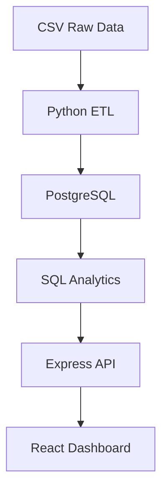
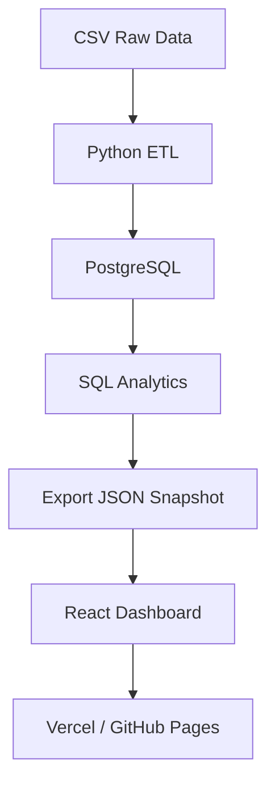

# RetailIQ Executive Dashboard

End-to-end Business Intelligence portfolio project for global electronics retail analytics. Transforms raw retail CSV exports into a PostgreSQL star schema, serves analytics through an Express REST API, and presents insights in a production-quality React executive dashboard.

Built for C-level executives and regional managers to monitor revenue, compare store and product performance, and support strategic decisions.

---

## Live Demo

**Vercel (Static Portfolio Mode):** [https://your-demo.vercel.app](https://your-demo.vercel.app)

**GitHub Pages (Static Portfolio Mode):** [https://your-username.github.io/retailiq-executive-dashboard/](https://your-username.github.io/retailiq-executive-dashboard/)

> Replace the URLs above after deploying. The public demo runs without a backend using exported JSON snapshots generated from the PostgreSQL analytics layer.

---

## Screenshots

| Executive Overview | Revenue Trend | Product Rankings |
|---|---|---|
|  |  |  |

| Country Analysis | Customer Leaderboard | Executive Insights |
|---|---|---|
|  |  |  |

> Add screenshots to `docs/screenshots/` after capturing from the running dashboard.

---

## Tech Stack

### Frontend
- React
- TypeScript
- Vite
- TailwindCSS
- Recharts

### Backend
- Node.js
- Express

### Database
- PostgreSQL

### Analytics
- Python
- Pandas
- SQL

### Deployment
- Vercel
- GitHub Pages

---

## Features

- Interactive executive dashboard
- Multi-filter analytics (Year, Country, Category)
- KPI monitoring with period-over-period trends
- Revenue trends
- Country analysis
- Product performance rankings
- Store performance rankings
- Customer insights
- Brand analysis
- Category analysis
- Static deployment mode (portfolio demo without backend)
- Full backend implementation (ETL → PostgreSQL → Express API)

---

## Architecture

### Development (Full Stack)



### Portfolio (Static Demo)



---

## Folder Structure

```
retailiq-executive-dashboard/
├── analysis/                  # Production SQL analytics queries
│   └── executive_analysis.sql
├── dashboard/                 # BI specification and wireframes
│   └── bi_specification.md
├── data/
│   ├── raw/                   # Source CSV files (unchanged)
│   └── processed/             # ETL output CSVs
├── docs/                      # Data dictionary, schema docs, screenshots
├── etl/                       # Python ETL pipeline
│   ├── config.py
│   ├── io_utils.py
│   ├── transform.py
│   └── run_etl.py
├── frontend/                  # React + TypeScript dashboard
│   ├── public/data/           # Static JSON snapshots for portfolio demo
│   │   ├── dashboard.json     # Pre-computed filter snapshots
│   │   └── filters.json       # Filter options
│   └── src/                   # Components, hooks, API layer
├── server/                    # Express REST API
│   ├── scripts/
│   │   └── export-static-data.ts  # Generates static JSON from PostgreSQL
│   └── src/                   # API routes and query layer
├── sql/                       # PostgreSQL schema, import, views
│   ├── schema.sql
│   ├── import.sql
│   └── views.sql
└── requirements.txt           # Python dependencies
```

---

## Static Demo Explanation

The **public deployment** uses exported JSON snapshots in `frontend/public/data/`:

- `filters.json` — available Year, Country, and Category values
- `dashboard.json` — 630 pre-computed dashboard responses (every filter combination) exported from the same PostgreSQL query layer as the Express API

When `VITE_USE_STATIC=true`, the React app loads these files instead of calling `/api/*`. The dashboard **looks and behaves identically** — same KPIs, charts, filters, and insights.

The repository still contains the **complete backend implementation**:

- Python ETL pipeline (`etl/`)
- PostgreSQL schema and SQL analytics (`sql/`, `analysis/`)
- Express REST API (`server/`)
- Full-stack development workflow

To refresh static snapshots after database changes:

```bash
cd server
npm run export:static
```

---

## Quick Start

### Full Stack Development Mode

**1. Python ETL**

```bash
python -m venv .venv
source .venv/bin/activate
pip install -r requirements.txt
python etl/run_etl.py
```

**2. PostgreSQL**

```bash
createdb retailiq
psql -d retailiq -f sql/schema.sql
psql -d retailiq -f sql/import.sql
psql -d retailiq -f sql/views.sql
```

**3. Express API**

```bash
cd server
cp .env.example .env   # set DATABASE_URL if needed
npm install
npm start              # http://localhost:3001
```

**4. React Dashboard (API mode)**

```bash
cd frontend
cp .env.example .env   # VITE_USE_STATIC=false (default)
npm install
npm run dev            # http://localhost:5173
```

### Static Portfolio Demo Mode (Local)

```bash
cd frontend
npm run dev:static     # loads /public/data/*.json
```

Or build for production:

```bash
cd frontend
npm run build:static
npm run preview:static
```

---

## Deployment

### Vercel (Recommended)

1. Import the repository on [Vercel](https://vercel.com)
2. Set **Root Directory** to `frontend`
3. Build command: `npm run build:static` (configured in `frontend/vercel.json`)
4. Deploy — no backend required

### GitHub Pages

1. Enable GitHub Pages (Source: GitHub Actions) in repository settings
2. Push to `main` — workflow `.github/workflows/deploy-pages.yml` builds with `npm run build:pages`
3. Or build manually:

```bash
cd frontend
npm run build:pages   # sets VITE_BASE_PATH for project-site URL
```

---

## Dual Mode Configuration

| Variable | Default | Description |
|---|---|---|
| `VITE_USE_STATIC` | `false` | `true` = load JSON snapshots; `false` = Express API |
| `VITE_BASE_PATH` | `/` | Base path for GitHub Pages subpath deployments |

See `frontend/.env.example` for reference.

---

## Resume Highlights

- Designed PostgreSQL analytical database (star schema with facts and dimensions)
- Built Python ETL pipeline with Pandas (encoding detection, cleaning, normalization)
- Developed SQL analytics layer for executive KPIs and business questions
- Built Express REST API with parameterized filtering
- Developed React + TypeScript dashboard with Recharts visualizations
- Created reusable multi-filter analytics system
- Implemented static deployment mode for portfolio hosting
- Designed executive BI dashboard for leadership decision-making

---

## Future Improvements

- Add authentication and role-based access for multi-tenant deployments
- Schedule automated ETL and snapshot refresh via cron or Airflow
- Add year-over-year and quarter-over-quarter comparison views
- Integrate real-time data via change-data-capture (CDC)
- Add drill-down navigation from KPI cards to detail pages
- Export dashboard views to PDF for board reporting
- Add unit and integration tests across ETL, API, and frontend
- Deploy full-stack mode with Docker Compose for one-command local setup

---

## License

Portfolio / educational use. Dataset structure follows common Contoso retail sample patterns.
